# AI 零代码应用生成平台

### 4 大核心能力

1）智能代码生成：用户输入需求描述，AI 自动分析并选择合适的生成策略，通过工具调用生成代码文件，采用流式输出让用户实时看到 AI 的执行过程。目前支持纯HTML、HTML + CSS + JS和Vue3三种类型前端项目生成。

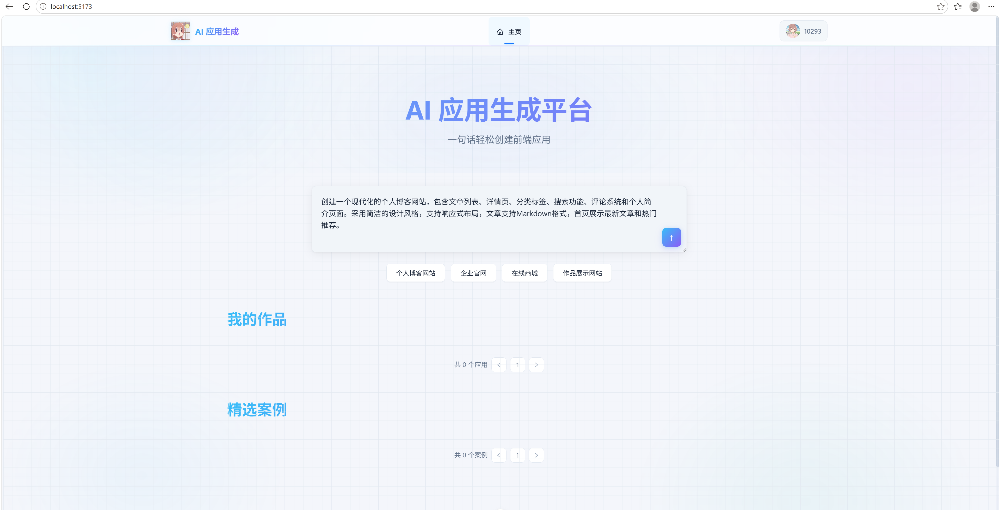

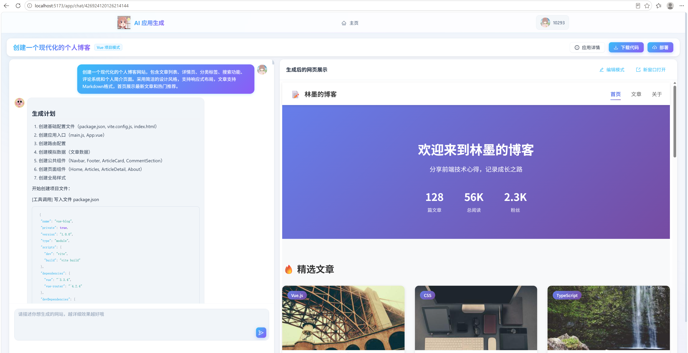

2）可视化编辑：生成的应用将实时展示，可以进入编辑模式，自由选择网页元素并且和 AI 对话来快速修改页面，直到满意为止。

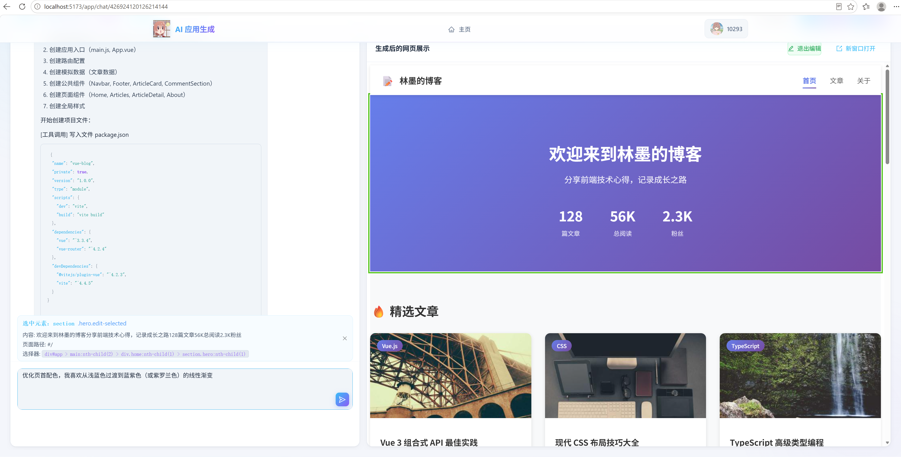

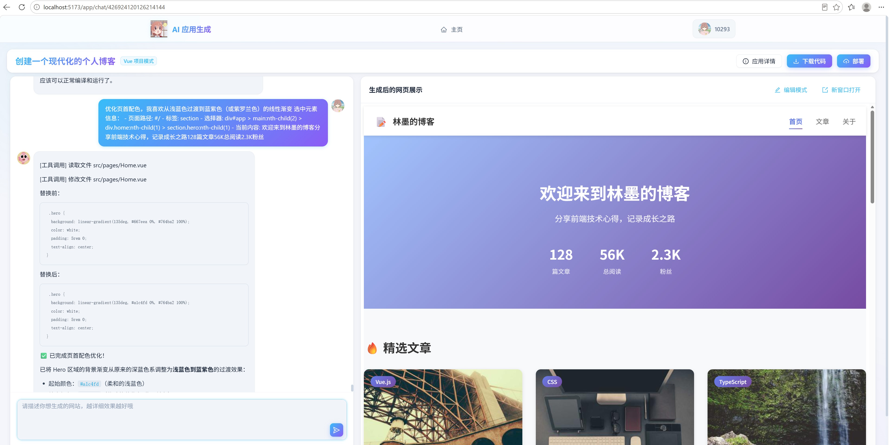

3）一键部署分享：可以将生成的应用一键部署到云端并自动截取封面图，获得可访问的地址进行分享，同时支持完整项目源码下载。

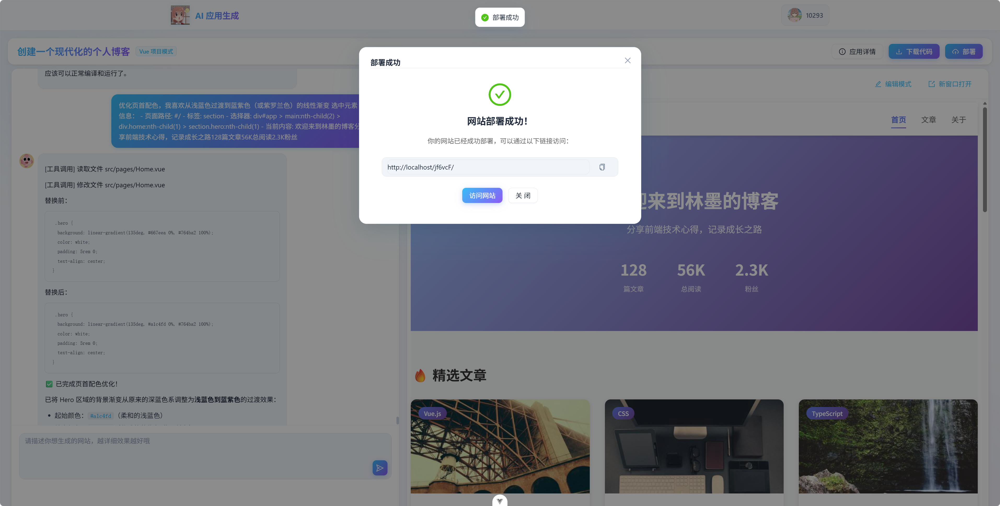

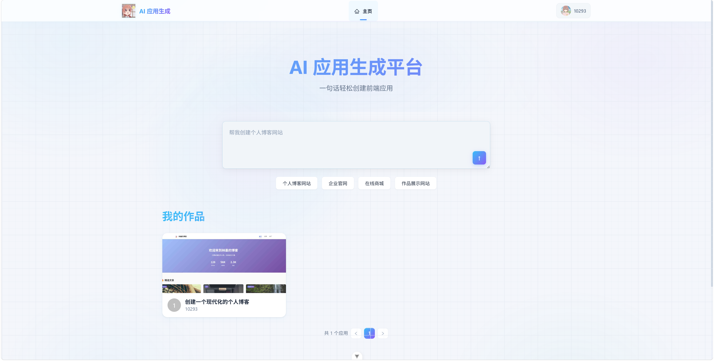

4）企业级管理：提供用户管理、应用管理、系统监控、业务指标监控等后台功能，管理员可以设置精选应用、监控 AI 调用情况和系统性能。

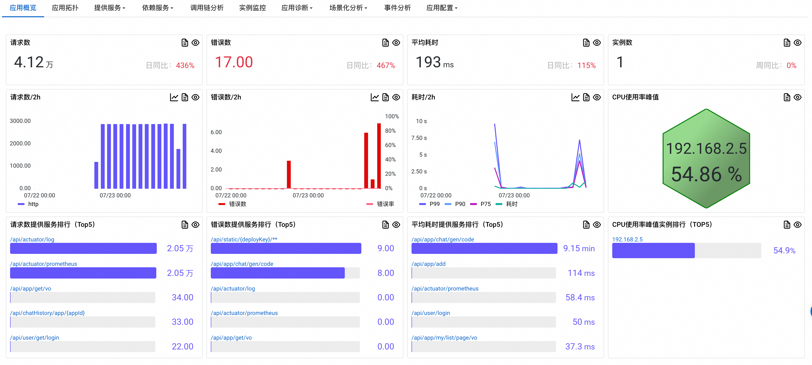

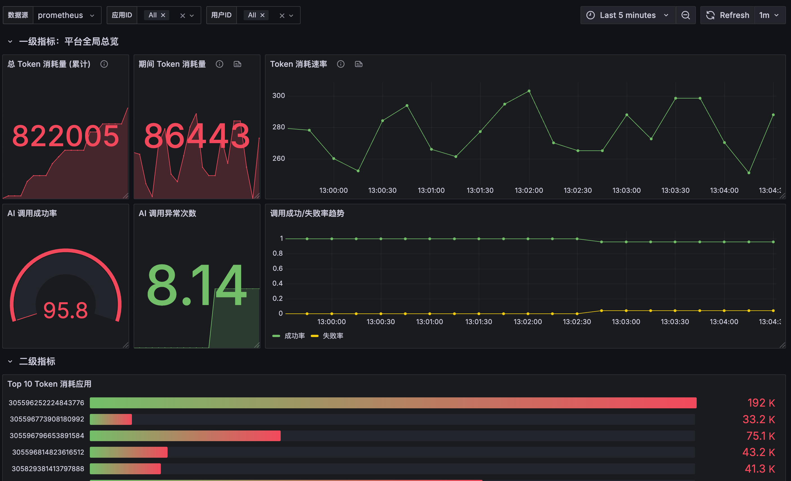

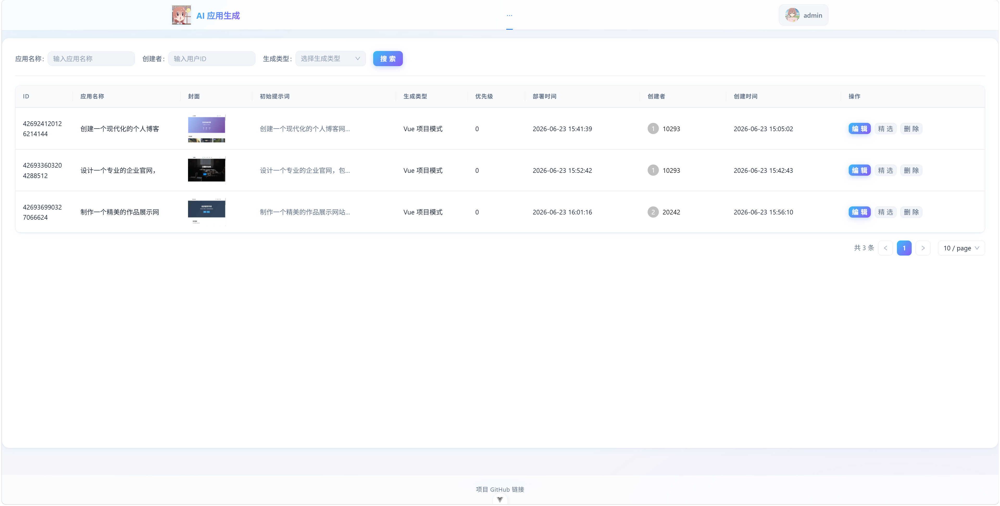

### 完整功能模块

**一、应用模块**

**用户基础功能**

- 创建应用
- 编辑应用信息
- 删除自己的应用
- 查看应用详情
- 分页查询自己的应用列表
- 查看精选应用列表

**用户高级功能**

- 实时查看应用效果
- 应用部署
- 应用封面生成
- 可视化编辑应用
- 应用代码下载

**管理功能（管理员专属）**

- 管理所有应用
- 设置精选应用

**二、对话历史模块**

**对话管理**

- 保存用户消息
- 保存 AI 回复消息
- 游标分页查询对话历史
- 删除对话记录

**对话记忆**

- Redis 持久化会话记忆
- 多轮对话上下文保持
- 按应用隔离对话记忆
- 从数据库加载历史对话
- 对话记忆 TTL

**三、监控模块**

**ARMS 系统监控**

- Java 应用性能监控
- 应用调用链追踪
- 异常分析诊断
- 网络请求性能监控
- 资源池监控
- AI 调用日志入库

**Prometheus 自定义监控**

- Token 消耗监控
- AI 调用成功率监控

**四、AI 代码生成模块**

- 原生 HTML 项目生成
- 原生多文件项目生成
- Vue 工程项目生成
- AI 智能选择生成方案
- AI 工作流项目生成

**五、用户模块**

- 用户注册
- 用户邮箱验证码校验
- 用户登录
- 用户注销
- 获取当前登录用户信息
- 用户权限控制
- 管理用户（管理员专属）

**六、系统优化**

- 性能优化
- 安全优化
- 流量保护
- 成本优化
- 稳定性优化

其余功能截图：

用户注册

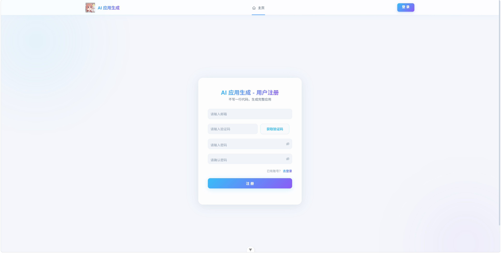

用户登录

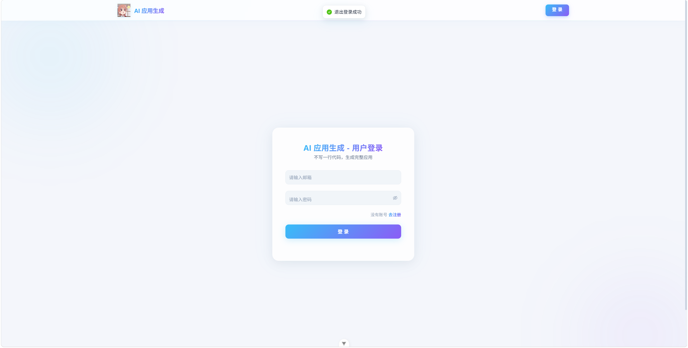

用户管理

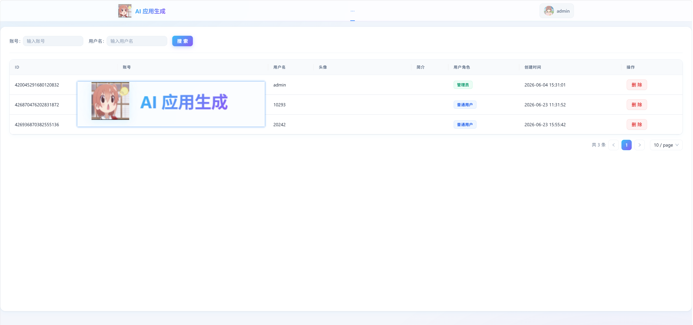

应用详情

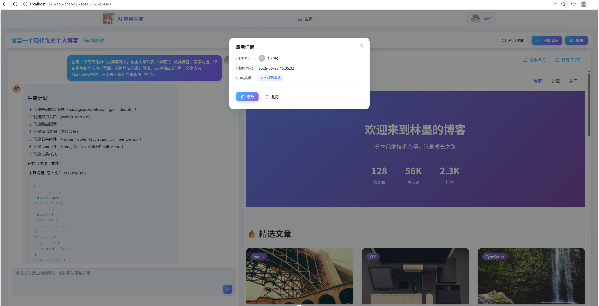

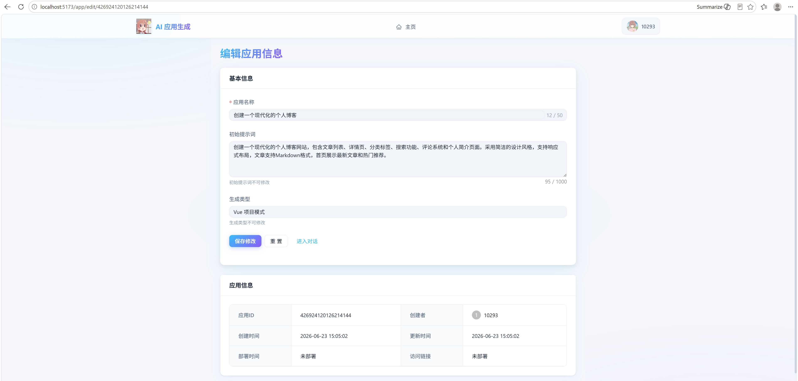

下载代码

### 架构设计

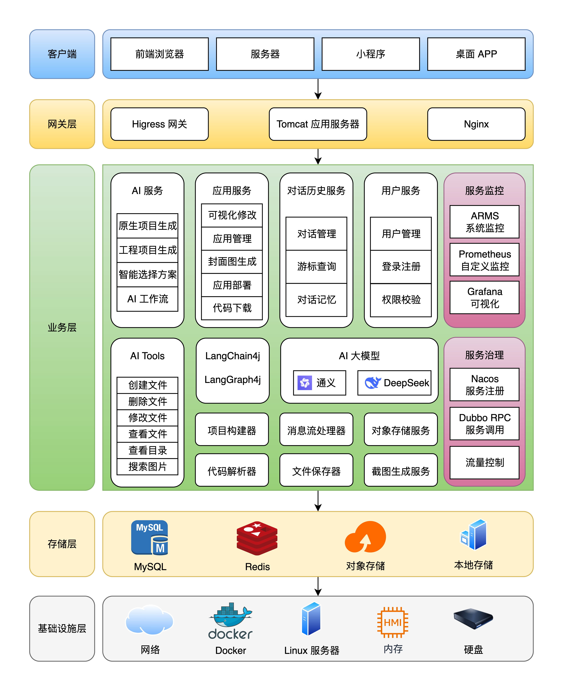

### 技术栈

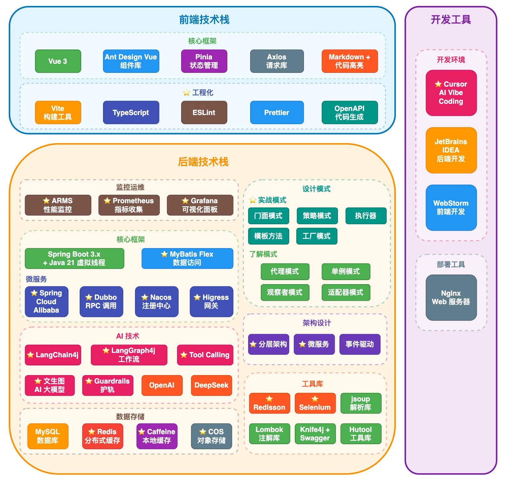

### 核心业务流程

