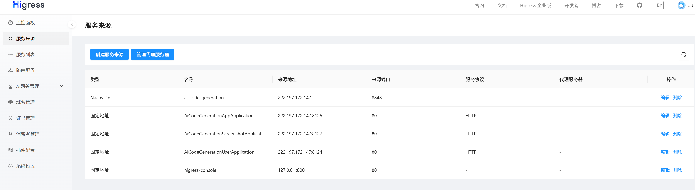
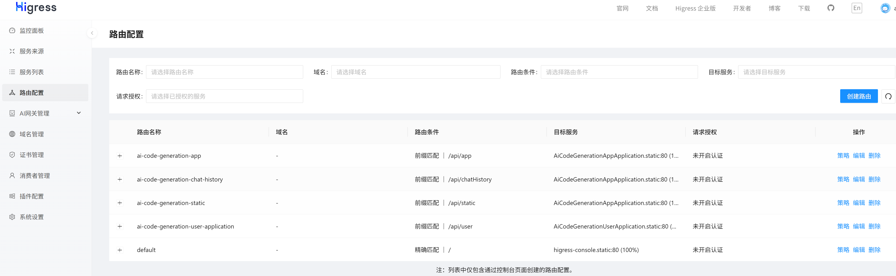

接口文档，测试调用接口：http://localhost:8123/api/doc.html
Vue脚手架提供的调试工具devtools: http://localhost:5173/__devtools__/
nginx文件目录：D:\idea_java_projects\ai-code-generation\nginx-1.30.0 访问地址举例：http://localhost/hSx9or/
redis文件目录(已遗弃，改为Docker Desktop启动)：E:\tools\Redis-x64-5.0.14.1

Prompt编写指南：https://help.aliyun.com/zh/model-studio/prompt-engineering-guide?spm=a2c4g.11186623.help-menu-2400256.d_0_12_0.39f04769RCkinV&scm=20140722.H_2735998._.OR_help-T_cn~zh-V_1
注意**：deepseek-chat今年7月份过期 deepseek还有20余额

powershell:
docker stop redis → 关闭 Redis
docker start redis → 启动 Redis
docker ps → 看运行状态

Prometheus+Grafana安装路径 D:\idea_java_projects\ai-code-generation
Prometheus：
在当前文件夹的地址栏输入 cmd 或 powershell，按回车，即可在当前目录打开终端。
执行启动命令 .\prometheus.exe --config.file=prometheus.yml
打开浏览器，访问：http://localhost:9090

Grafana：
在 bin 文件夹的地址栏输入 cmd 或 powershell，按回车，即可在当前目录打开终端。
执行启动命令 .\grafana.exe server
访问 Grafana 界面
打开浏览器，访问：http://localhost:3000
首次登录使用默认账号密码：admin / admin
net stop grafana 停止服务

Nacos:
进入bin目录，cmd执行startup.cmd -m standalone 访问 http://localhost:8848/nacos 账号密码默认nacos
先 AiCodeGenerationUserApplication 、AiCodeGenerationScreenshotApplication 再 AiCodeGenerationAppApplication

Higress:
创建docker run -d --name higress-ai -v D:\369\data:/data -e O11Y=on -p 8001:8001 -p 8080:8080 -p 8443:8443 higress-registry.cn-hangzhou.cr.aliyuncs.com/higress/all-in-one:latest
Docker Desktop启动docker start higress-ai + docker ps
控制台：http://localhost:8001/ 账号admin密码admin
注意前端vite.config.ts中8123要改为8080，创建改为如下则前端为8123即可
docker run -d --name higress-ai -v D:\369\data:/data -e O11Y=on -p 8001:8001 -p 8123:8080 -p 8443:8443 higress-registry.cn-hangzhou.cr.aliyuncs.com/higress/all-in-one:latest
添加 --restart=always 参数，可以确保 Higress 随 Docker 桌面版自动启动。--rm 容器停止后删除
注意ipv4地址改变，配置要变

